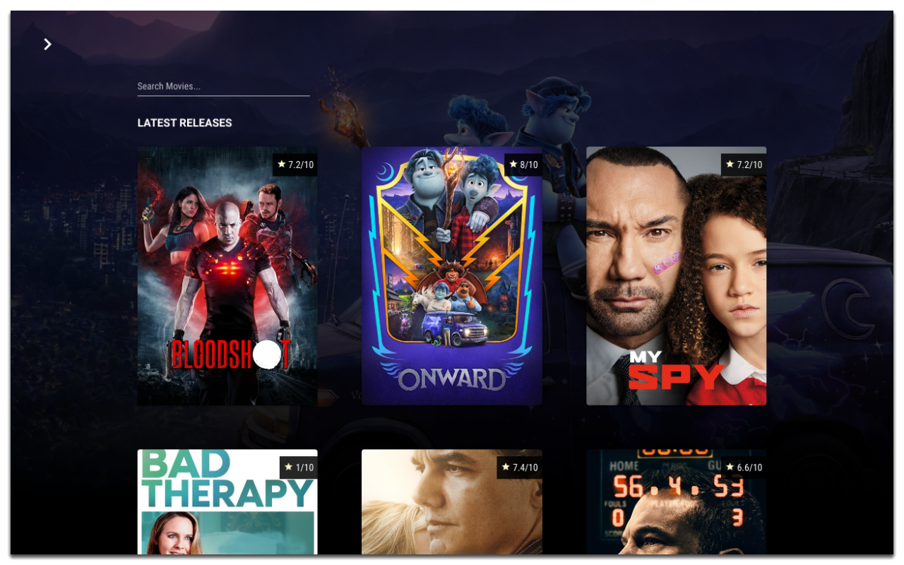
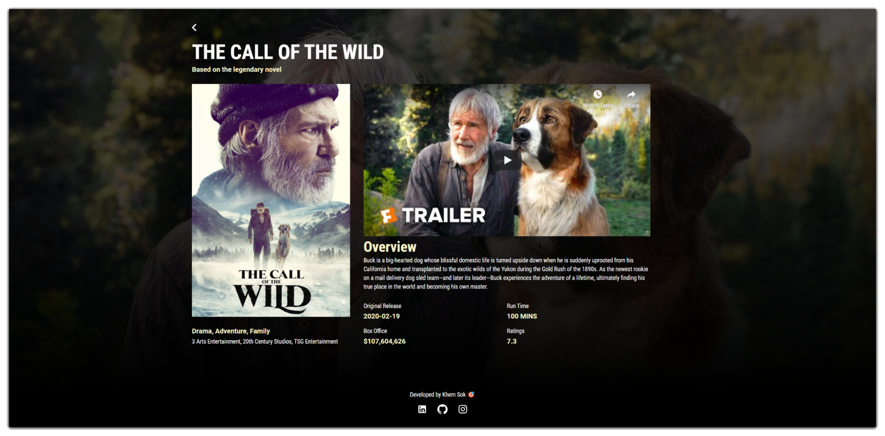

<h1>Film Look Up 🍿</h1>

Simple film look up 🔥

### Features 🎨

- **🔎 Search Film**: User can search their favorite films with autocomplete features
- **🥊 Categories**: Sort movies by different categories with infinite scrolling features
- **🎥 Movie Stats**: Display descriptions + data on how the movie did

### Technologies 🔨

- **🌐 React JS**: Front End
- **⚡React Router**: Page Routing
- **🍿 [TMDB](https://www.themoviedb.org/?language=en-US)**: API to fetch the data

### Developed by [Khem Sok](https://github.com/khemsok) 🧐

Thanks For Reading!
